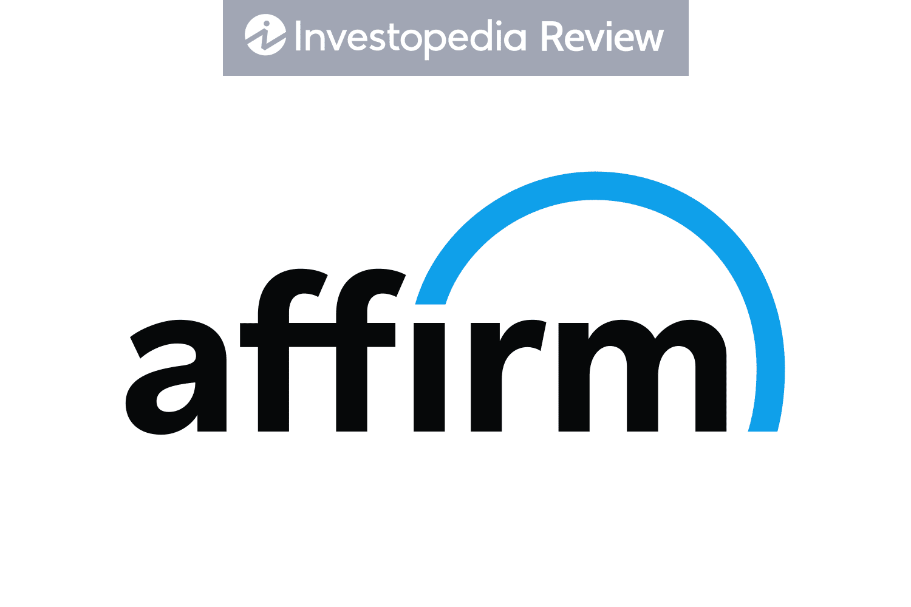

# Affirm Personal credit domain

Fintech module 1 homework. A study of Affirm  Affirm is a publicly traded company. Affirm is a Buy Now, Pay Later company founded in 2012 by Max Levchin (CEO), Jeffrey Kaditz, and Nathan Gettings and headquartered in San Francisco. According to Usatoday, Affirm’s customers can pay over time with term lengths from six weeks to 60 months. Split pay, Affirm’s biweekly pay-in-4 option, is always interest-free. Affirm’s monthly payment options can be interest-free or interest-bearing with simple interest ranging from a 10% to 30% APR. Simple interest means the interest is based on a fixed percentage that never compounds, so customers never owe a penny more than what they agree to at checkout. According to Investopedia, affirm is a type of short-term financing that allows consumers to make purchases and pay for them at a future date, often interest-free. Affirm provides point of sale loans that specifically targets the idealistic market. That is, they provide a service that is needed. Affirm was founded as part of the initial portfolio of startup studio HVF. According to Yahoo finance, affirm offers a buy now, pay later service as an alternative to traditional credits which does a hard pull of your credit. Affirm (AFRM) has a market cap of $6.56B and trading at $21.46.

# Business activities of Affirm:
Affirm wants to be the future of commerce and payments through its innovative, proprietary business model. By using an AI-based algorithm to do a soft pull on a customer’s credit report as opposed to a hard pull. The company’s intended customers are millennials. With 12.7 million active consumers and 207.000 active merchants. Affirm has two main competitors are Klarna and Afterpay. But it has an advantage of them in the sense that it also offers the affirm card. Affirm card is gives you the flexibility to pay now and over time without any of the fees or compound interest. Affirm has 14 registered patents and 37 trademarks of intellectual property. Cloud based technologies, artificial intelligence and machine learning are key aspects that makes its integration with merchants wonderful.

# Landscape:
Affirm is in the personal credit domain. Over the last 5-10 years, this domain has seen some key players like Klarna, Afterpay, Sezzle, Quadpay etc., spring up. But its sustainability lies in the consumer spending and confidence in the economy. Affirm has stores like Amazon, Walmart, Target etc., in its merchant like. These stores are frequented by millennials, thus further making it easy for the customer to have a worry-free checkout. On the part of the merchant, affirm would check for credit worthiness and underwrite the loan. Just like Affirm offers four interest-free payments, so does Afterpay who offers four interest-free payments over six weeks.

# Results:
according to www.ggoogle.com, Affirm makes money through four revenue streams: network revenue, interest income, gains on sales of loans, and servicing income. But when compared to the industry standard and competitors, Klarna is tops it. Klarna tops Affirm in the sense that it lets customers split purchases into four interest free payment, pay in 30 days or sign up for 36 months financing. As at the time of writing this, Affirm is down 54% since IPO.

# Recommendation:
I would advise the Affirm to start offering credit cards, because the company already has a debit card with installment payment. Since the company benefits from both customer and merchant, I would advise the company to lower its intertest rate and not charge any last fees. Offering a few select credit cards for the millennial and reducing fees would make them more competitive in a consumer centered market. The affordability of these goods also keys factors too. Apps with clean and easy to navigate UI gets more attention. Although Affirm offers real-time decision making to decide, when the AI based algorithm cannot decide, instead of referring it for further consideration, it declines. So, I would recommend that instead of outrightly declining customers application, a special department is created where customers are reconsidered for credit. That is, another attempt at getting that business. Affirm does a soft pull of customers credit, but only report some loans to Experian. I would recommend that all late and delinquent loans be reported to Experian.

# *Resources:*
[Google](http://www.google.com)